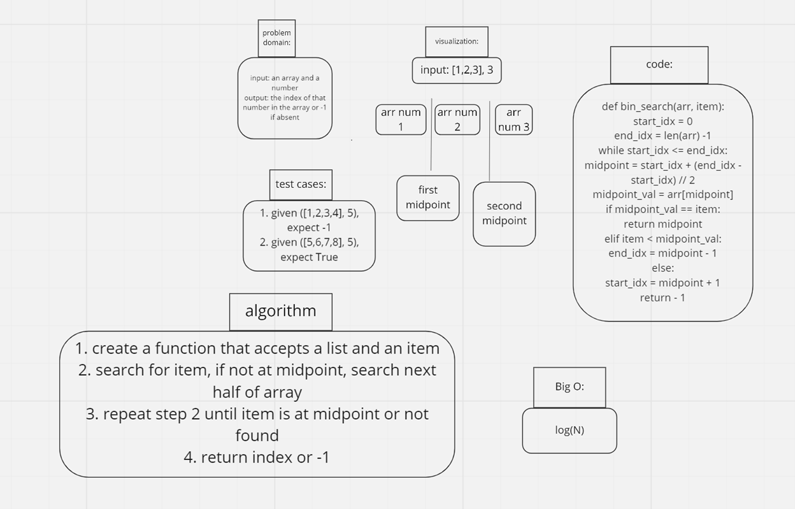

# Binary search of sorted array
- given an array and a value, return index of that value in the array

## Whiteboard process

## Approach & efficiency
- I used a while loop approach because it's efficient, the Big O is log(N).
