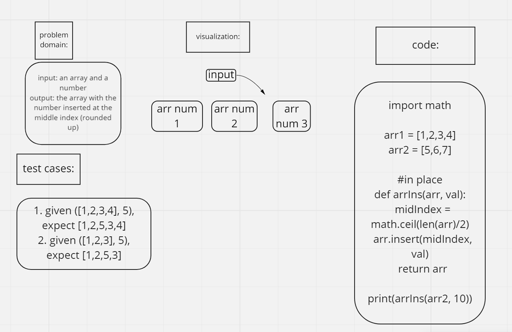

## Insert to middle of array

## Whiteboard process

## Approach and efficiency
- I used Math.ceil() and .insert(), because this would put something in the middle of an array
- I think this is O(N), because the .insert() makes it O(N), right?
